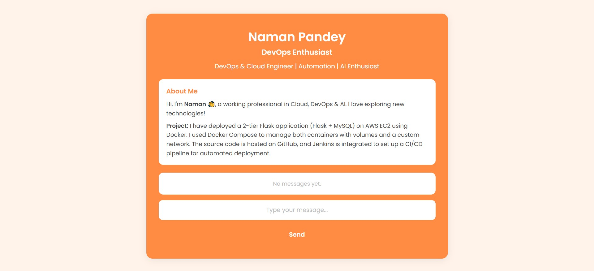
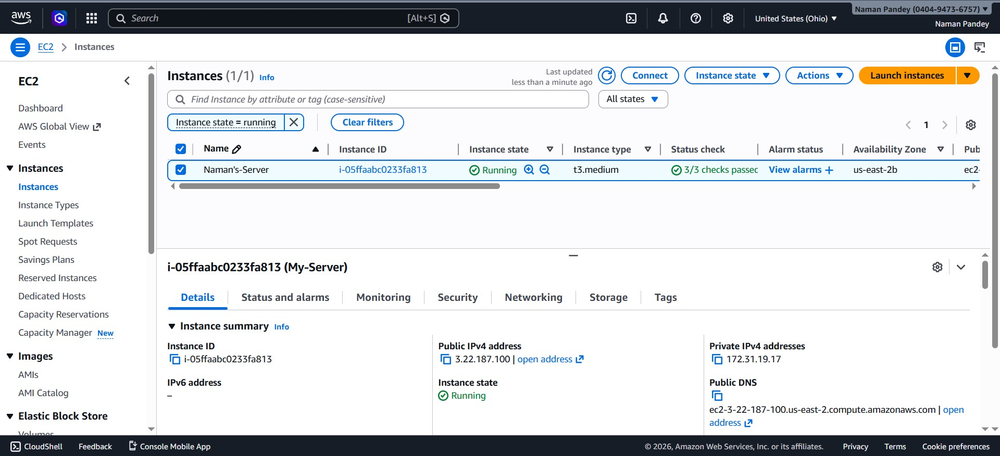
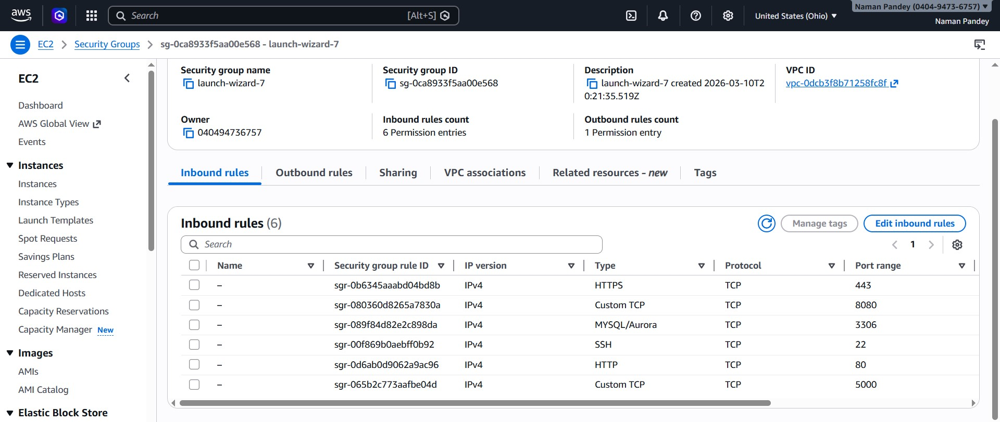
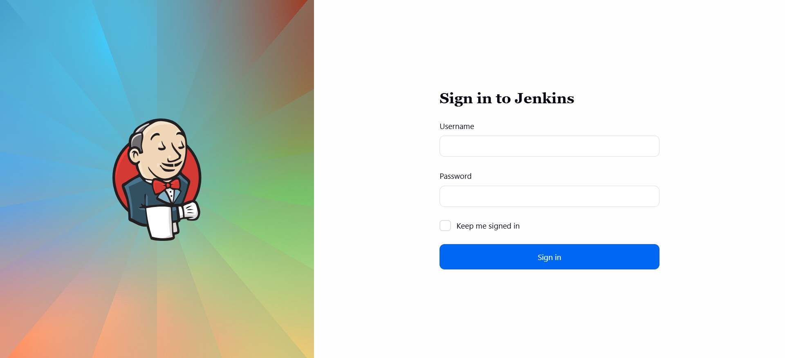
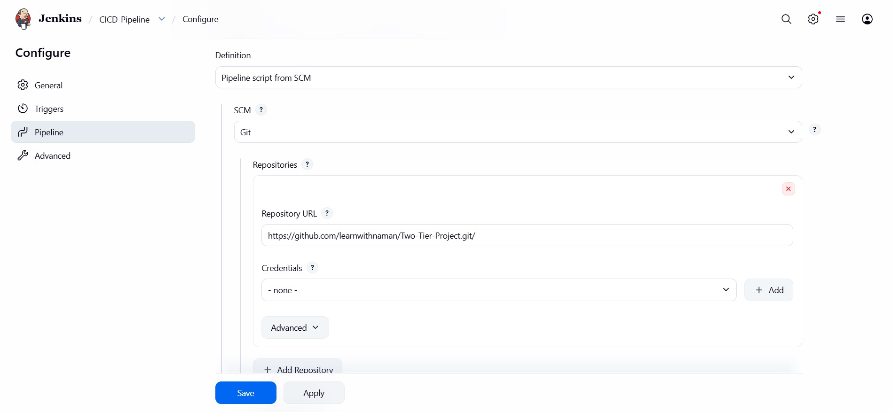
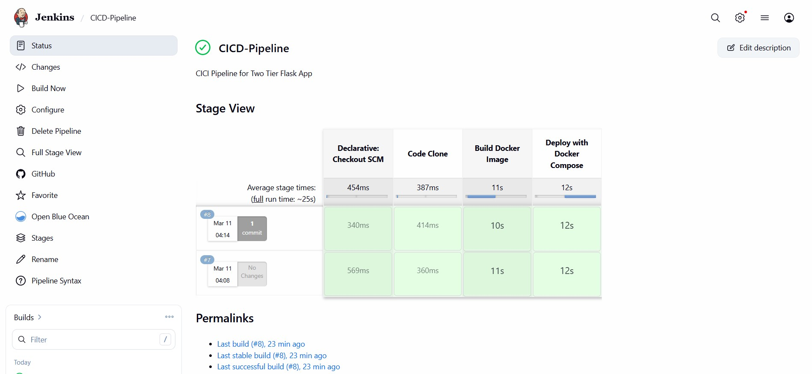
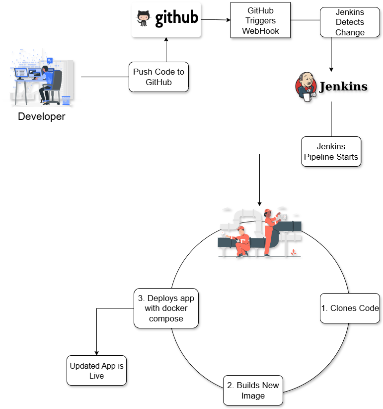

# 🚀 Two-Tier Flask App: DevOps CI/CD Pipeline on AWS

## 📌 Project Overview

This project demonstrates a complete **CI/CD pipeline for a two-tier web application** using modern DevOps tools.

The application is built using **Flask (Python) and MySQL**, deployed using **Docker containers**. Jenkins automates the build and deployment process whenever new code is pushed to GitHub. The entire setup runs on an **AWS EC2 instance**.



## 🏗️ Architecture Diagram


```
+-----------------+      +----------------------+      +-----------------------------+
|   Developer     |----->|     GitHub Repo      |----->|        Jenkins Server       |
| (pushes code)   |      | (Source Code Mgmt)   |      |  (on AWS EC2)               |
+-----------------+      +----------------------+      |                             |
                                                       | 1. Clones Repo              |
                                                       | 2. Builds Docker Image      |
                                                       | 3. Runs Docker Compose      |
                                                       +--------------+--------------+
                                                                      |
                                                                      | Deploys
                                                                      v
                                                       +-----------------------------+
                                                       |      Application Server     |
                                                       |      (Same AWS EC2)         |
                                                       |                             |
                                                       | +-------------------------+ |
                                                       | | Docker Container: Flask | |
                                                       | +-------------------------+ |
                                                       |              |              |
                                                       |              v              |
                                                       | +-------------------------+ |
                                                       | | Docker Container: MySQL | |
                                                       | +-------------------------+ |
                                                       +-----------------------------+
```


## 🛠️ DevOps Tools Used

| Tool | Purpose |
|------|---------|
| AWS EC2 | Cloud infrastructure |
| Git & GitHub | Source code management |
| Jenkins | CI/CD automation |
| Docker | Containerization |
| Docker Compose | Multi-container orchestration |
| Flask | Backend application |
| MySQL | Database |


## Step 1: Launch AWS EC2 Instance

1. Go to AWS EC2 console
2. Launch a new instance
3. Select **Ubuntu 22.04 LTS**
4. Instance type: **t2.micro**
5. Create a key pair for SSH access



## Step 2: Configure Security Group

Allow the following inbound ports:

| Service | Port |
|---------|------|
| SSH | 22 |
| HTTP | 80 |
| Flask Application | 5000 |
| Jenkins | 8080 |
| MySQL | 3306 |




## Step 3: Connect to EC2

```bash
ssh -i your-key.pem ubuntu@your-ec2-public-ip
```

## Step 4: Install Required Dependencies

```bash
# Update packages
sudo apt update && sudo apt upgrade -y

# Install Git, Docker, Docker Compose
sudo apt install git docker.io docker-compose-v2 -y

# Start Docker
sudo systemctl start docker
sudo systemctl enable docker

# Allow current user to run Docker
sudo usermod -aG docker $USER
newgrp docker
```

## Step 5: Install Jenkins

```bash
# Install Java
sudo apt install openjdk-17-jdk -y

# Add Jenkins repository
curl -fsSL https://pkg.jenkins.io/debian-stable/jenkins.io-2023.key | sudo tee /usr/share/keyrings/jenkins-keyring.asc

echo deb [signed-by=/usr/share/keyrings/jenkins-keyring.asc] https://pkg.jenkins.io/debian-stable binary/ | sudo tee /etc/apt/sources.list.d/jenkins.list

# Install Jenkins
sudo apt update
sudo apt install jenkins -y

# Start Jenkins
sudo systemctl start jenkins
sudo systemctl enable jenkins
```

## Step 6: Jenkins Initial Setup

```bash
# Get admin password
sudo cat /var/lib/jenkins/secrets/initialAdminPassword
```

Open in browser: `http://<EC2-PUBLIC-IP>:8080`

Paste the password and install suggested plugins.

<!-- 📷 Place image: diagrams/jenkins-setup.png -->


## Step 7: Give Jenkins Docker Permission

```bash
sudo usermod -aG docker jenkins
sudo systemctl restart jenkins
```




## Step 8: GitHub Repository Structure

```
Dockerfile
docker-compose.yml
Jenkinsfile
app.py
requirements.txt
templates/
```


## 🐳 Dockerfile

```dockerfile
FROM python:3.10-slim

WORKDIR /app

RUN apt update && apt install -y gcc default-libmysqlclient-dev pkg-config && \
    rm -rf /var/lib/apt/lists/*

COPY . .

RUN pip install -r requirement.txt

EXPOSE 5000

CMD ["python","app.py"]
```

## 🐙 Docker Compose File

```yaml
version: "3.8"

services:

  mysql:
    image: mysql
    container_name: mysql
    environment:
      MYSQL_ROOT_PASSWORD: root
      MYSQL_DATABASE: devops
    ports:
      - "3306:3306"

  flask:
    build: .
    container_name: flask-app
    ports:
      - "5000:5000"
    environment:
      MYSQL_HOST: mysql
      MYSQL_USER: root
      MYSQL_PASSWORD: root
      MYSQL_DB: devops
    depends_on:
      - mysql
```

## 🔁 Jenkins Pipeline (Jenkinsfile)

```groovy
pipeline {
    agent any

    stages {

        stage ('Code Clone') {
            steps {
                git branch: 'main', url: 'https://github.com/learnwithnaman/Two-Tier-Project.git'
            }
        }

        stage ('Build Docker Image') {
            steps {
                sh 'docker build -t flask-app:latest .'
            }
        }

        stage ('Deploy with Docker Compose') {
            steps {
                sh 'docker compose down || true'
                sh 'docker compose up --build -d'
            }
        }

    }
}
```


## Step 9: Create Jenkins Pipeline

1. Go to Jenkins dashboard
2. Click **New Item** → Select **Pipeline**
3. Choose **Pipeline script from SCM**
4. Select **Git**
5. Enter your GitHub repository URL
6. Script path: `Jenkinsfile`




## Step 10: Run the Pipeline

Click **Build Now** in Jenkins. The pipeline will:

1. Clone GitHub repository
2. Build Docker image
3. Deploy using Docker Compose




## ✅ Verify Deployment

```bash
# Check running containers
docker ps

# Open app in browser
http://<EC2-PUBLIC-IP>:5000
```


## 🌐 Infrastructure Diagram


## 🔄 DevOps Workflow




## 🏁 Conclusion

This project demonstrates a real-world DevOps workflow where deployment is fully automated. By integrating **GitHub, Jenkins, Docker, and AWS**, the process becomes faster, repeatable, and reliable.


*Built with ❤️ by **Naman Pandey** — DevOps | Cloud Engineer*